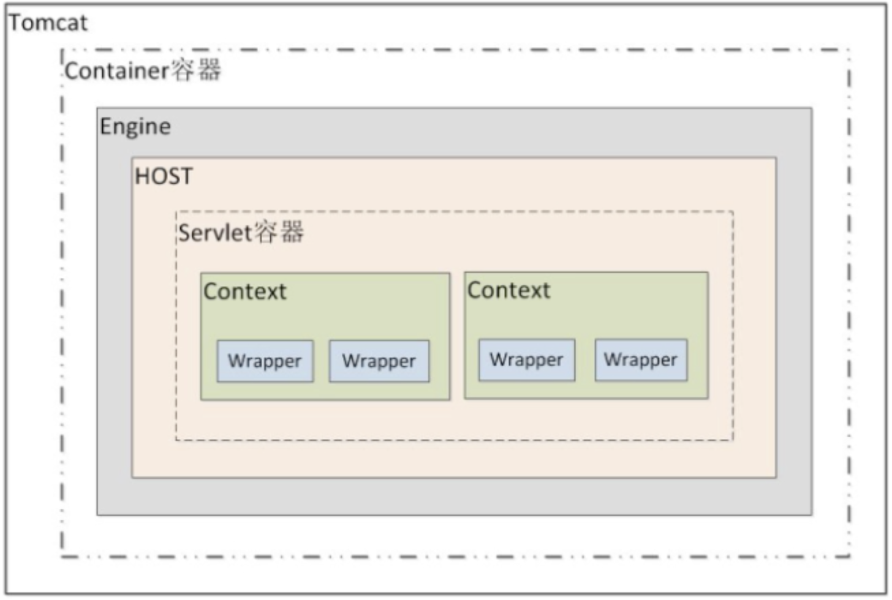
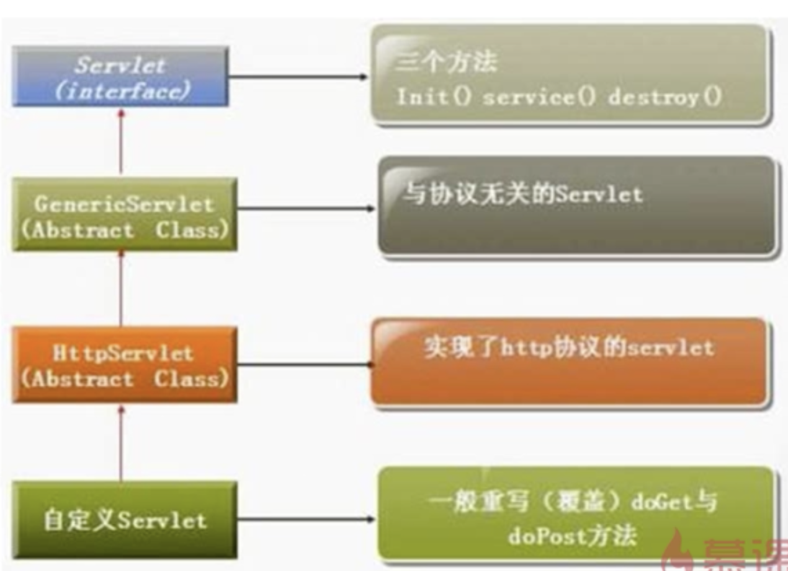

开启了一个新的学习计划

## Spring 教程
<https://www.ctolib.com/docs-wkspring-c-index.html>  2018年01月10日23:32:32

## 今天我开始了一个新的课程的学习
<https://www.imooc.com/learn/269> JAVA遇见HTML——Servlet篇
2018年01月11日22:17:31

### 什么是Servlet
> Servlet 是在服务器上运行的小程序，一个Servlet就是一个Java类，并且可以通过 “请求 - 响应” 编程模型来访问的这个驻留在服务器内存里的小程序。

### Tomcat容器等级
> Tomcat 的容器分为四个等级， Servlet 的容器管理 Context 容器，一个 Context 对应一个 Web 工程。

### 手工编写第一个Servlet

1. 继承 `HttpServlet`
2. 重写 `doGet()` 或者 `doPost()` 方法
3. 在 `web.xml` 中注册 Servlet

